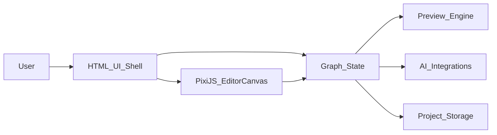

# Tiny Realms

Tiny Realms - это концепция сервиса визуального вайбкодинга, в котором пользователь собирает логику не через длинные файлы с кодом, а прямо на интерактивном полотне. Ноды можно перетаскивать, соединять стрелками, настраивать через слайдеры и другие контролы, а результат видеть как цельную и наглядную схему.

Идея проекта в том, чтобы работа с AI, графикой и автоматизацией ощущалась не как написание шаблонного кода, а как сборка живой визуальной системы. Интерфейс должен оставаться понятным, красивым и управляемым даже тогда, когда сценарии становятся сложнее.

Важный принцип Tiny Realms: весь продукт должен быть выполнен в честном пиксельном стиле. Это касается не только декоративных деталей, но и всей визуальной системы целиком - нод, кнопок, панелей, сетки, иконок, состояний, анимаций и общей атмосферы редактора.

## Что Это

Tiny Realms - это node-based редактор для сборки визуальных пайплайнов:

- ноды представляют действия, инструменты, генераторы, трансформации или логические блоки;
- стрелки показывают, как между этими блоками передаются данные, события и зависимости;
- слайдеры и контролы позволяют быстро менять параметры без погружения в код;
- весь сценарий остается видимым на одной доске, поэтому его проще понимать, объяснять и развивать.

Это не просто "канвас с коробками", а среда, в которой экспериментировать должно быть быстро, естественно и визуально понятно.

## Как Это Должно Работать

Продукт должен ощущаться как смесь визуального редактора, песочницы и креативного инструмента:

- пользователь перетаскивает ноды на общее рабочее поле;
- соединяет выходы и входы визуальными связями;
- меняет параметры прямо в ноде или в боковой панели;
- получает live-preview по мере изменения графа;
- сохраняет, загружает и переиспользует готовые схемы.

При этом весь опыт должен визуально собираться в едином pixel-art направлении: четкие формы, читаемые пиксельные контуры, аккуратная палитра, ретро-характер без потери удобства и современного UX.

## Возможности MVP

Первая рабочая версия должна быть компактной, но сильной по базовому UX:

- большое или бесконечное полотно с `pan` и `zoom`;
- создание, перемещение, выделение и удаление нод;
- соединения между нодами через стрелки или линии;
- панель свойств со слайдерами, переключателями, текстовыми полями и пресетами;
- базовые категории нод: генерация, трансформация, логика, вывод;
- сериализация графа, чтобы схемы можно было сохранять и открывать снова;
- live-preview для текущего результата или выбранной ветки графа.

## Почему Такой Формат

Визуальные сценарии часто проще понять, чем сырой код, особенно когда система интерактивная, сильно завязана на параметрах или строится через эксперименты. Node-based подход помогает:

- видеть структуру целиком;
- быстрее замечать связи между шагами;
- оперативно настраивать поведение;
- прототипировать без потери наглядности.

Такой формат особенно хорошо подходит для креативных инструментов, AI-пайплайнов, визуальной автоматизации и быстрых прототипов.

## PixiJS И Интерфейс

`PixiJS` планируется как слой рендеринга для интерактивного редакторского канваса, а не как замена всему веб-интерфейсу.

Рекомендуемое разделение:

- `HTML/CSS` для оболочки приложения: toolbar, sidebar, формы, кнопки, модалки, поиск, настройки;
- `PixiJS` для визуальной сцены: ноды, коннекторы, сетка, hover-состояния, выделение, `zoom`, `pan` и выразительная анимация.

Такой гибридный подход позволяет сохранить обычный UI простым и удобным, а рабочую область сделать действительно живой, плавной и визуально сильной. При этом и `HTML/CSS`, и `PixiJS`-часть должны подчиняться одному правилу: весь интерфейс выдержан в цельном честном пиксельном стиле, а не в смеси пиксельных и обычных web-компонентов.

## Техническое Направление

На текущем этапе проект находится на уровне продуктовой концепции, поэтому стек стоит воспринимать как направление, а не как окончательно зафиксированное решение.

Базовый технический вектор:

- web-приложение как основная платформа;
- структурированная оболочка интерфейса на стандартных frontend-инструментах;
- отдельный rendering-слой для node editor области;
- AI-интеграции для генерации, трансформации или оркестрации;
- хранение пользовательских графов, пресетов и состояний проекта.

Возможный стек:

- `React` или `Vue` для оболочки приложения;
- `PixiJS` для canvas-рендеринга и интерактивной сцены;
- backend-сервисы для AI-задач, хранения, авторизации и синхронизации проектов;
- схема графа для сериализации нод, связей, параметров и состояния вида.

## Концептуальная Архитектура

## Принципы Дизайна

- Наглядность прежде всего: граф должен оставаться читаемым по мере роста.
- Прямое взаимодействие: пользователь должен перетаскивать, соединять, настраивать и исследовать без лишнего трения.
- Быстрая обратная связь: изменения параметров должны ощущаться сразу.
- Красота по умолчанию: визуальная иерархия, отступы и анимация важны не меньше функций.
- Постепенное усложнение: простые сценарии должны собираться легко, сложные - не превращаться в хаос.
- Честный пиксельный стиль во всем: визуальный язык должен быть цельным на уровне canvas, кнопок, панелей, типографики, иконок и состояний интерфейса.

## Roadmap

### Этап 1: Прототип Редактора

- собрать оболочку приложения;
- поднять базовый canvas с `pan` и `zoom`;
- отрисовать перетаскиваемые ноды и связи;
- добавить выделение и простое редактирование свойств.

### Этап 2: Рабочий MVP

- добавить библиотеку нод и категории;
- реализовать сохранение и загрузку графов;
- подключить live-preview;
- улучшить компоновку, интеракции и визуальный полиш.

### Этап 3: Основа Продукта

- добавить шаблоны и пресеты;
- ввести совместную работу или shared flows;
- подключить реальные AI-провайдеры и execution backend;
- добавить версионность, историю изменений и более безопасные сценарии экспериментов.

## Статус Проекта

Сейчас репозиторий находится на стадии концепции и определения направления. Этот README фиксирует форму будущего продукта и технический вектор, а дальше будет уточняться по мере появления первых частей реализации.
