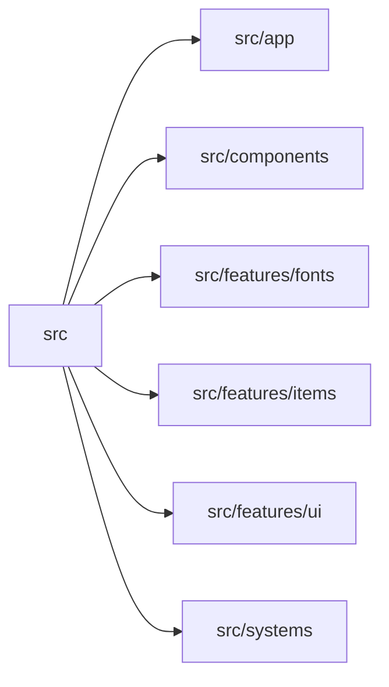

# src

> Автогенерируемый README модуля.

## 🌟 Кратко

Главная папка исходников приложения.

## 👥 Подмодули

- 👤 [`src/app`](app/README.md) - Группа модулей для `app`.
- 👤 [`src/assets`](assets/README.md) - Общие загрузчики ассетов, координаты атласа и текстурные helper-модули.
- 👤 [`src/components`](components/README.md) - Переиспользуемые UI-компоненты и строительные блоки сцены.
- 👤 [`src/features`](features/README.md) - Группа модулей для `features`.
- 👤 [`src/systems`](systems/README.md) - Группа модулей для `systems`.

## 📄 Файлы

- 📄 [`main.ts.md`](main.ts.md) - Точка входа приложения, которая поднимает runtime. Исходник: [`main.ts`](../../src/main.ts)
- 📄 [`style.css.md`](style.css.md) - Общий stylesheet для страницы и canvas-представления. Исходник: [`style.css`](../../src/style.css)
- 📄 [`vite-env.d.ts.md`](vite-env.d.ts.md) - Исходный модуль с 0 внутренними зависимостями. Исходник: [`vite-env.d.ts`](../../src/vite-env.d.ts)

## 🍎 Зависимости

### 🍎 Зависит от

- `src/app`
- `src/components`
- `src/features/fonts`
- `src/features/items`
- `src/features/ui`
- `src/systems`

### 🍑 Используется в

- нет
