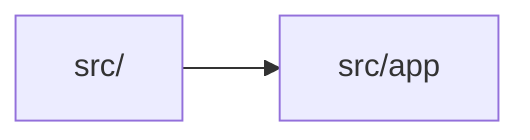

# src/app

> Автогенерируемый README модуля.

## 🌟 Кратко

Группа модулей для `app`.

## 👥 Подмодули

- 👤 Дочерних подмодулей нет.

## 📄 Файлы

- 📄 [`boot.ts.md`](boot.ts.md) - Исходный модуль с 0 внутренними зависимостями. Исходник: [`boot.ts`](../../../src/app/boot.ts)
- 📄 [`scheduleStableViewportLayout.ts.md`](scheduleStableViewportLayout.ts.md) - Исходный модуль с 0 внутренними зависимостями. Исходник: [`scheduleStableViewportLayout.ts`](../../../src/app/scheduleStableViewportLayout.ts)

## 🍎 Зависимости

### 🍎 Зависит от

- нет

### 🍑 Используется в

- `src/`

