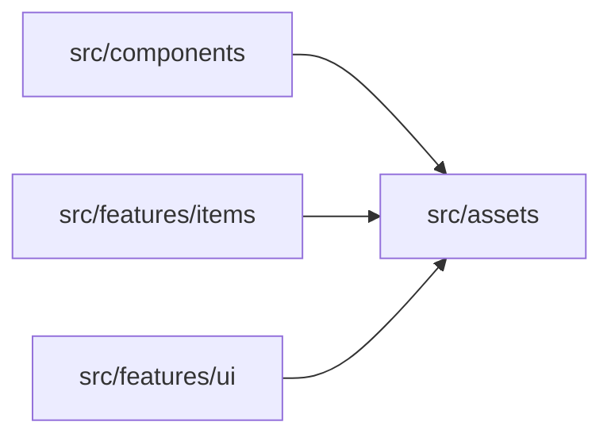

# src/assets

> Автогенерируемый README модуля.

## 🌟 Кратко

Общие загрузчики ассетов, координаты атласа и текстурные helper-модули.

## 👥 Подмодули

- 👤 Дочерних подмодулей нет.

## 📄 Файлы

- 📄 [`icons16Atlas.ts.md`](icons16Atlas.ts.md) - Модуль ассетов, который отдает фреймы медиа или helper-логику загрузки. Исходник: [`icons16Atlas.ts`](../../../src/assets/icons16Atlas.ts)
- 📄 [`uiAtlas.ts.md`](uiAtlas.ts.md) - Модуль ассетов, который отдает фреймы медиа или helper-логику загрузки. Исходник: [`uiAtlas.ts`](../../../src/assets/uiAtlas.ts)
- 📄 [`uiMiniAtlas.ts.md`](uiMiniAtlas.ts.md) - Модуль ассетов, который отдает фреймы медиа или helper-логику загрузки. Исходник: [`uiMiniAtlas.ts`](../../../src/assets/uiMiniAtlas.ts)

## 🍎 Зависимости

### 🍎 Зависит от

- нет

### 🍑 Используется в

- `src/components`
- `src/features/items`
- `src/features/ui`

