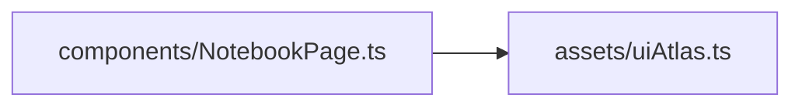

# uiAtlas.ts.md

> Автогенерируемая карточка исходного файла.

## 🌟 Для чего нужен

Нужен для хранения координат, текстур или helper-логики, связанной с ассетами.

## 🍎 Принцип

Работает как слой доступа к ассетам: хранит данные о ресурсах и отдает их в удобной для других модулей форме.

## 🧩 Методы

- В этом файле нет явных именованных методов верхнего уровня.

## 👥 Связи

- 👤 Родительский модуль: [`src/assets`](README.md)
- 📄 Исходный файл: [`uiAtlas.ts`](../../../src/assets/uiAtlas.ts)

### 🍎 Зависит от

- 🍎 Нет прямых локальных зависимостей.

### 🍑 Используется в

- 🍑 `components/NotebookPage.ts`

