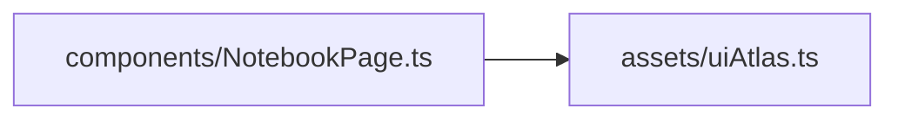
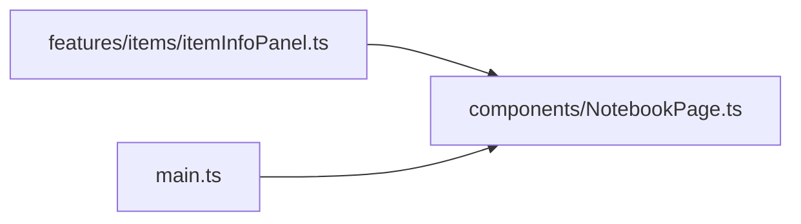

# NotebookPage.ts.md

> Автогенерируемая карточка исходного файла.

## 🌟 Для чего нужен

Нужен как переиспользуемый строительный блок интерфейса или сцены.

## 🍎 Принцип

Собирает один самостоятельный визуальный блок и отдает его как готовую часть интерфейса или сцены.

## 🧩 Методы

- В этом файле нет явных именованных методов верхнего уровня.

## 👥 Связи

- 👤 Родительский модуль: [`src/components`](README.md)
- 📄 Исходный файл: [`NotebookPage.ts`](../../../src/components/NotebookPage.ts)

### 🍎 Зависит от

- 🍎 `assets/uiAtlas.ts`

### 🍑 Используется в

- 🍑 `features/items/itemInfoPanel.ts`
- 🍑 `main.ts`

