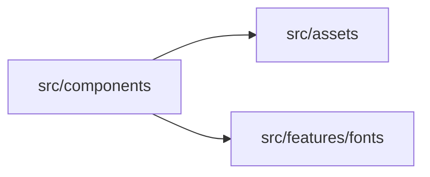
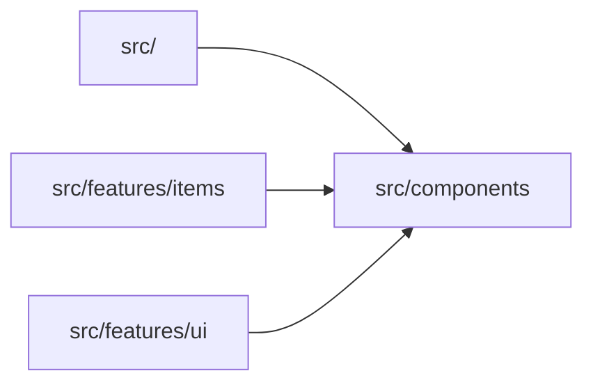

# src/components

> Автогенерируемый README модуля.

## 🌟 Кратко

Переиспользуемые UI-компоненты и строительные блоки сцены.

## 👥 Подмодули

- 👤 Дочерних подмодулей нет.

## 📄 Файлы

- 📄 [`draggableIcons.ts.md`](draggableIcons.ts.md) - Переиспользуемый модуль компонента, который рендерится приложением. Исходник: [`draggableIcons.ts`](../../../src/components/draggableIcons.ts)
- 📄 [`NotebookPage.ts.md`](NotebookPage.ts.md) - Переиспользуемый модуль компонента, который рендерится приложением. Исходник: [`NotebookPage.ts`](../../../src/components/NotebookPage.ts)
- 📄 [`uiButton.ts.md`](uiButton.ts.md) - Переиспользуемый модуль компонента, который рендерится приложением. Исходник: [`uiButton.ts`](../../../src/components/uiButton.ts)
- 📄 [`uiWindow.ts.md`](uiWindow.ts.md) - Переиспользуемый модуль компонента, который рендерится приложением. Исходник: [`uiWindow.ts`](../../../src/components/uiWindow.ts)

## 🍎 Зависимости

### 🍎 Зависит от

- `src/assets`
- `src/features/fonts`

### 🍑 Используется в

- `src/`
- `src/features/items`
- `src/features/ui`

