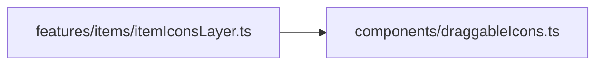

# draggableIcons.ts.md

> Автогенерируемая карточка исходного файла.

## 🌟 Для чего нужен

Нужен как переиспользуемый строительный блок интерфейса или сцены.

## 🍎 Принцип

Собирает один самостоятельный визуальный блок и отдает его как готовую часть интерфейса или сцены.

## 🧩 Методы

- В этом файле нет явных именованных методов верхнего уровня.

## 🔑 Ключевые константы

### `DOUBLE_TAP_MAX_DELAY_MS`

- Значение: `350`
- Для чего нужен: Нужна как опорная константа файла: хранит значение, с которым работает остальная логика.

### `DOUBLE_TAP_MAX_DISTANCE`

- Значение: `24`
- Для чего нужен: Нужна как опорная константа файла: хранит значение, с которым работает остальная логика.

## 👥 Связи

- 👤 Родительский модуль: [`src/components`](README.md)
- 📄 Исходный файл: [`draggableIcons.ts`](../../../src/components/draggableIcons.ts)

### 🍎 Зависит от

- 🍎 Нет прямых локальных зависимостей.

### 🍑 Используется в

- 🍑 `features/items/itemIconsLayer.ts`

