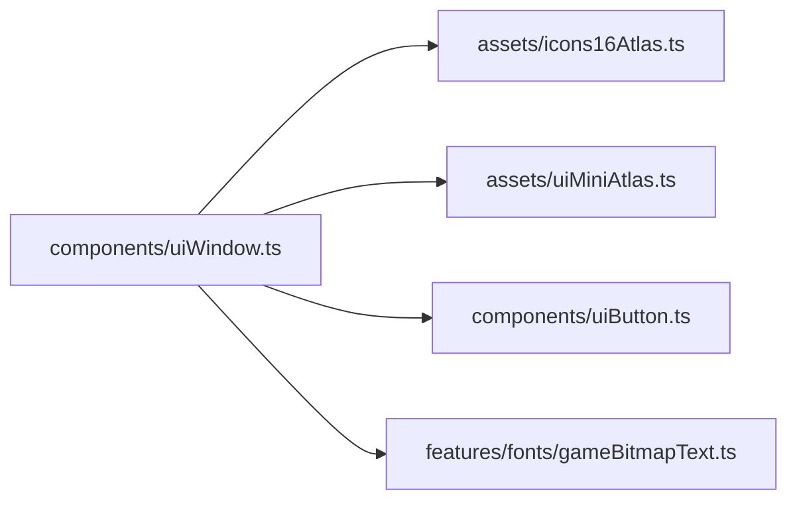
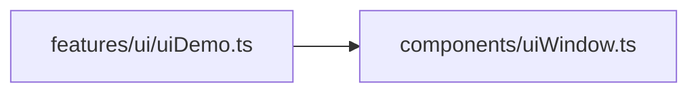

# uiWindow.ts.md

> Автогенерируемая карточка исходного файла.

## 🌟 Для чего нужен

Нужен как переиспользуемый строительный блок интерфейса или сцены.

## 🍎 Принцип

Собирает один самостоятельный визуальный блок и отдает его как готовую часть интерфейса или сцены.

## 🧩 Методы

- В этом файле нет явных именованных методов верхнего уровня.

## 🔑 Ключевые константы

### `WINDOW_MESSAGE_TINT`

- Значение: `0xc8b8a8`
- Для чего нужен: Нужна как опорная константа файла: хранит значение, с которым работает остальная логика.

### `PANEL_TILE_SCALE`

- Значение: `4`
- Для чего нужен: Нужна как опорная константа файла: хранит значение, с которым работает остальная логика.

### `PANEL_TILE_SIZE`

- Значение: `UI_MINI_CELL * PANEL_TILE_SCALE`
- Для чего нужен: Нужна как опорная константа файла: хранит значение, с которым работает остальная логика.

### `DEFAULT_WINDOW_WIDTH`

- Значение: `384`
- Для чего нужен: Нужна как опорная константа файла: хранит значение, с которым работает остальная логика.

### `DEFAULT_WINDOW_HEIGHT`

- Значение: `256`
- Для чего нужен: Нужна как опорная константа файла: хранит значение, с которым работает остальная логика.

### `DEFAULT_ALERT_WIDTH`

- Значение: `384`
- Для чего нужен: Нужна как опорная константа файла: хранит значение, с которым работает остальная логика.

### `DEFAULT_ALERT_HEIGHT`

- Значение: `192`
- Для чего нужен: Нужна как опорная константа файла: хранит значение, с которым работает остальная логика.

### `WINDOW_MESSAGE_INSET_X`

- Значение: `18`
- Для чего нужен: Нужна как опорная константа файла: хранит значение, с которым работает остальная логика.

### `WINDOW_MESSAGE_INSET_Y`

- Значение: `58`
- Для чего нужен: Нужна как опорная константа файла: хранит значение, с которым работает остальная логика.

### `WINDOW_SCROLL_COLUMN_W`

- Значение: `64`
- Для чего нужен: Нужна как опорная константа файла: хранит значение, с которым работает остальная логика.

### `WINDOW_MESSAGE_BOTTOM_RESERVE`

- Значение: `72`
- Для чего нужен: Нужна как опорная константа файла: хранит значение, с которым работает остальная логика.

### `WINDOW_MESSAGE_FONT_SIZE`

- Значение: `18`
- Для чего нужен: Нужна как опорная константа файла: хранит значение, с которым работает остальная логика.

### `WINDOW_MESSAGE_LINE_STEP`

- Значение: `Math.round(WINDOW_MESSAGE_FONT_SIZE * 1.125)`
- Для чего нужен: Нужна как опорная константа файла: хранит значение, с которым работает остальная логика.

### `ALERT_MESSAGE_BOTTOM_PAD`

- Значение: `24`
- Для чего нужен: Нужна как опорная константа файла: хранит значение, с которым работает остальная логика.

## 👥 Связи

- 👤 Родительский модуль: [`src/components`](README.md)
- 📄 Исходный файл: [`uiWindow.ts`](../../../src/components/uiWindow.ts)

### 🍎 Зависит от

- 🍎 `assets/icons16Atlas.ts`
- 🍎 `assets/uiMiniAtlas.ts`
- 🍎 `components/uiButton.ts`
- 🍎 `features/fonts/gameBitmapText.ts`

### 🍑 Используется в

- 🍑 `features/ui/uiDemo.ts`

