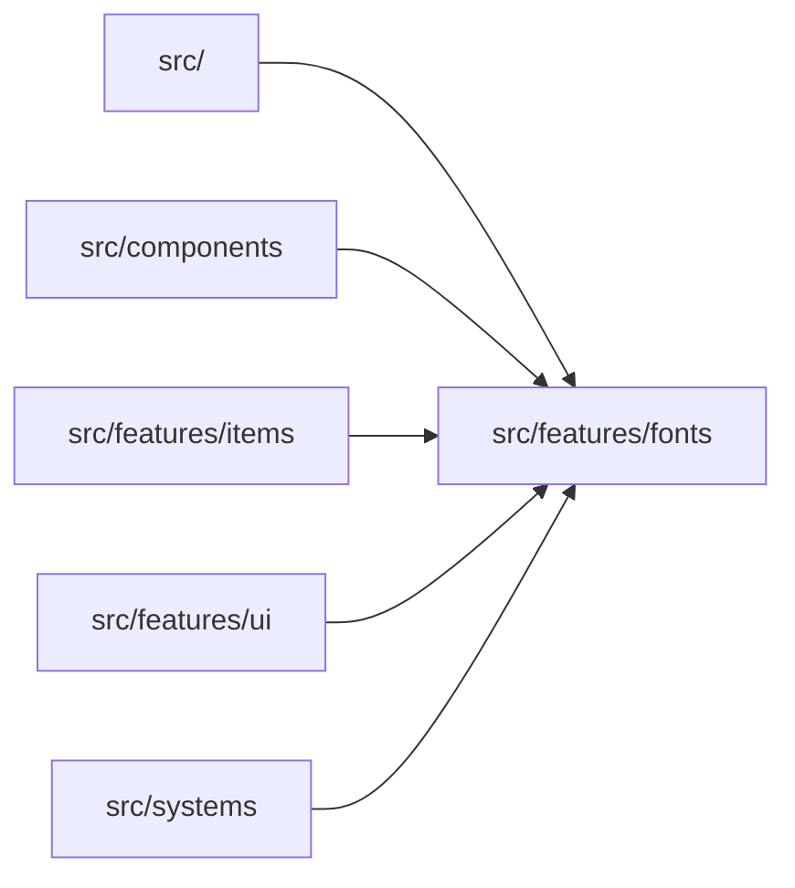

# src/features/fonts

> Автогенерируемый README модуля.

## 🌟 Кратко

Группа модулей для `features/fonts`.

## 👥 Подмодули

- 👤 Дочерних подмодулей нет.

## 📄 Файлы

- 📄 [`fontShowcase.ts.md`](fontShowcase.ts.md) - Исходный модуль с 1 внутренней зависимостью. Исходник: [`fontShowcase.ts`](../../../../src/features/fonts/fontShowcase.ts)
- 📄 [`gameBitmapText.ts.md`](gameBitmapText.ts.md) - Исходный модуль с 0 внутренними зависимостями. Исходник: [`gameBitmapText.ts`](../../../../src/features/fonts/gameBitmapText.ts)
- 📄 [`textAlignDemo.ts.md`](textAlignDemo.ts.md) - Исходный модуль с 1 внутренней зависимостью. Исходник: [`textAlignDemo.ts`](../../../../src/features/fonts/textAlignDemo.ts)
- 📄 [`typewriterBitmapText.ts.md`](typewriterBitmapText.ts.md) - Исходный модуль с 0 внутренними зависимостями. Исходник: [`typewriterBitmapText.ts`](../../../../src/features/fonts/typewriterBitmapText.ts)

## 🍎 Зависимости

### 🍎 Зависит от

- нет

### 🍑 Используется в

- `src/`
- `src/components`
- `src/features/items`
- `src/features/ui`
- `src/systems`

