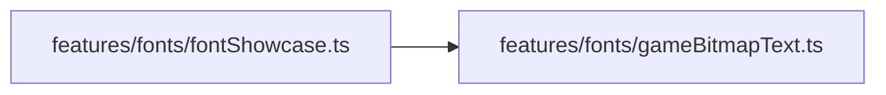

# fontShowcase.ts.md

> Автогенерируемая карточка исходного файла.

## 🌟 Для чего нужен

Нужен как отдельный модуль, который решает свою локальную задачу внутри проекта.

## 🍎 Принцип

Работает как локальный модуль проекта: получает входные данные, подготавливает результат и отдает его другим частям приложения.

## 🧩 Методы

- В этом файле нет явных именованных методов верхнего уровня.

## 🔑 Ключевые константы

### `SECTION_SPACING_Y`

- Значение: `212`
- Для чего нужен: Нужна как опорная константа файла: хранит значение, с которым работает остальная логика.

### `SECTION_TEXT_MAX_WIDTH`

- Значение: `392`
- Для чего нужен: Нужна как опорная константа файла: хранит значение, с которым работает остальная логика.

### `LANGUAGE_COLUMN_GAP`

- Значение: `452`
- Для чего нужен: Нужна как опорная константа файла: хранит значение, с которым работает остальная логика.

## 👥 Связи

- 👤 Родительский модуль: [`src/features/fonts`](README.md)
- 📄 Исходный файл: [`fontShowcase.ts`](../../../../src/features/fonts/fontShowcase.ts)

### 🍎 Зависит от

- 🍎 `features/fonts/gameBitmapText.ts`

### 🍑 Используется в

- 🍑 `main.ts`

