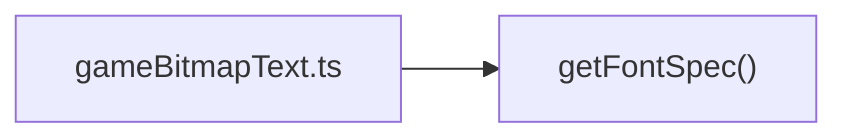
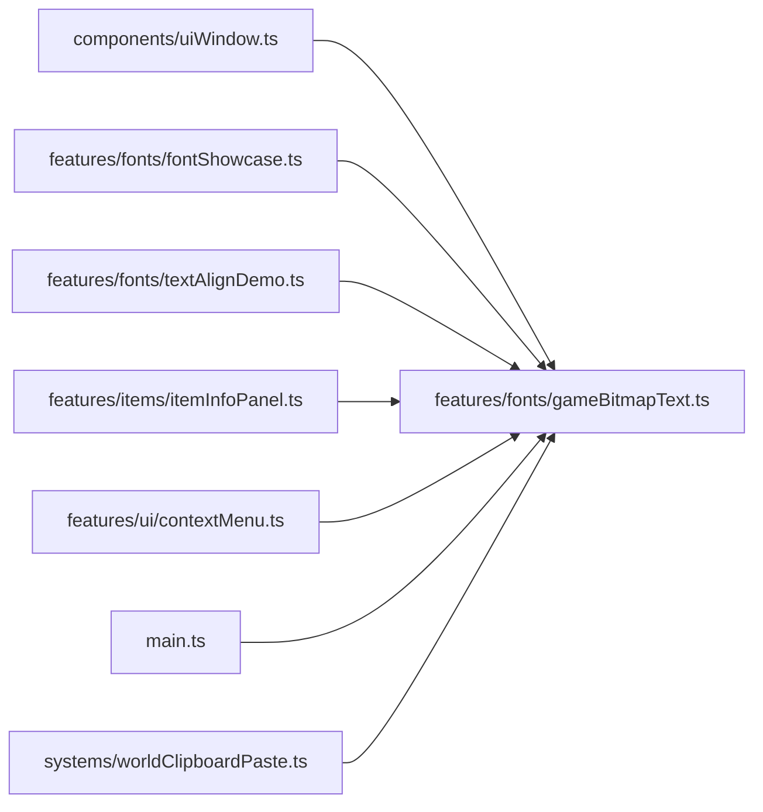

# gameBitmapText.ts.md

> Автогенерируемая карточка исходного файла.

## 🌟 Для чего нужен

Нужен как отдельный модуль, который решает свою локальную задачу внутри проекта.

## 🍎 Принцип

Работает как локальный модуль проекта: получает входные данные, подготавливает результат и отдает его другим частям приложения.

## 🧩 Методы

### `getFontSpec(face: GameFontFace)`

- Для чего нужен: Получает или подготавливает данные, которые нужны другим частям файла.
- Что использует: нет явных ключевых констант
- Какие методы вызывает: нет вызовов других именованных методов

## 🗺️ Карта зависимостей методов

## 🔑 Ключевые константы

### `FONT_CHARSET_LINES`

- Значение: `GAME_FONT_CHARSET_LINES_EN`
- Для чего нужен: Нужна как опорная константа файла: хранит значение, с которым работает остальная логика.

### `FONT_CHARSET_RU_LINES`

- Значение: `GAME_FONT_CHARSET_LINES_RU`
- Для чего нужен: Нужна как опорная константа файла: хранит значение, с которым работает остальная логика.

### `FONT_CHARSET`

- Значение: ``${FONT_CHARSET_LINES.join(' ')} ${FONT_CHARSET_RU_LINES.join(' ')} ``
- Для чего нужен: Нужна как опорная константа файла: хранит значение, с которым работает остальная логика.

### `BITMAP_FONT_RESOLUTION`

- Значение: `1`
- Для чего нужен: Нужна как опорная константа файла: хранит значение, с которым работает остальная логика.

### `BITMAP_FONT_PADDING`

- Значение: `1`
- Для чего нужен: Нужна как опорная константа файла: хранит значение, с которым работает остальная логика.

### `BITMAP_FONT_SOURCE_SIZE`

- Значение: `9`
- Для чего нужен: Нужна как опорная константа файла: хранит значение, с которым работает остальная логика.

### `BITMAP_FONT_SKIP_KERNING`

- Значение: `true`
- Для чего нужен: Нужна как опорная константа файла: хранит значение, с которым работает остальная логика.

### `TEXT_COLOR`

- Значение: `0x2f2419`
- Для чего нужен: Нужна как опорная константа файла: хранит значение, с которым работает остальная логика.

### `loadedCssFonts`

- Значение: `new Set<string>()`
- Для чего нужен: Нужна как опорная константа файла: хранит значение, с которым работает остальная логика.

### `installedBitmapFonts`

- Значение: `new Set<string>()`
- Для чего нужен: Нужна как опорная константа файла: хранит значение, с которым работает остальная логика.

### `TEST_ALIGN_MAX_WIDTH`

- Значение: `200`
- Для чего нужен: Нужна как опорная константа файла: хранит значение, с которым работает остальная логика.

## 👥 Связи

- 👤 Родительский модуль: [`src/features/fonts`](README.md)
- 📄 Исходный файл: [`gameBitmapText.ts`](../../../../src/features/fonts/gameBitmapText.ts)

### 🍎 Зависит от

- 🍎 Нет прямых локальных зависимостей.

### 🍑 Используется в

- 🍑 `components/uiWindow.ts`
- 🍑 `features/fonts/fontShowcase.ts`
- 🍑 `features/fonts/textAlignDemo.ts`
- 🍑 `features/items/itemInfoPanel.ts`
- 🍑 `features/ui/contextMenu.ts`
- 🍑 `main.ts`
- 🍑 `systems/worldClipboardPaste.ts`

