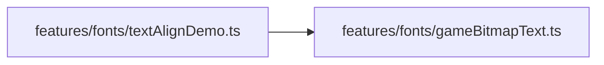
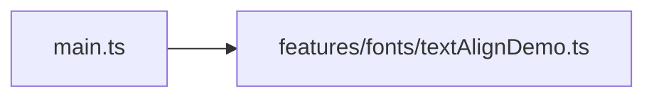

# textAlignDemo.ts.md

> Автогенерируемая карточка исходного файла.

## 🌟 Для чего нужен

Нужен как отдельный модуль, который решает свою локальную задачу внутри проекта.

## 🍎 Принцип

Работает как локальный модуль проекта: получает входные данные, подготавливает результат и отдает его другим частям приложения.

## 🧩 Методы

- В этом файле нет явных именованных методов верхнего уровня.

## 🔑 Ключевые константы

### `ROW_GAP`

- Значение: `6`
- Для чего нужен: Нужна как опорная константа файла: хранит значение, с которым работает остальная логика.

### `GROUP_GAP`

- Значение: `20`
- Для чего нужен: Нужна как опорная константа файла: хранит значение, с которым работает остальная логика.

### `FOOT_GAP`

- Значение: `20`
- Для чего нужен: Нужна как опорная константа файла: хранит значение, с которым работает остальная логика.

### `DENSE_BODY`

- Значение: `GAME_TEXT_SIZES.caption`
- Для чего нужен: Нужна как опорная константа файла: хранит значение, с которым работает остальная логика.

### `DENSE_MAX_WIDTH`

- Значение: `200 / 2`
- Для чего нужен: Нужна как опорная константа файла: хранит значение, с которым работает остальная логика.

### `ENGLISH_DENSE`

- Значение: `[ 'The quick brown fox jumps over the lazy dog. ', 'This block uses the same API as the...`
- Для чего нужен: Нужна как опорная константа файла: хранит значение, с которым работает остальная логика.

### `DEFAULT_WORLD_X`

- Значение: `24`
- Для чего нужен: Нужна как опорная константа файла: хранит значение, с которым работает остальная логика.

### `DEFAULT_WORLD_Y`

- Значение: `300`
- Для чего нужен: Нужна как опорная константа файла: хранит значение, с которым работает остальная логика.

## 👥 Связи

- 👤 Родительский модуль: [`src/features/fonts`](README.md)
- 📄 Исходный файл: [`textAlignDemo.ts`](../../../../src/features/fonts/textAlignDemo.ts)

### 🍎 Зависит от

- 🍎 `features/fonts/gameBitmapText.ts`

### 🍑 Используется в

- 🍑 `main.ts`

