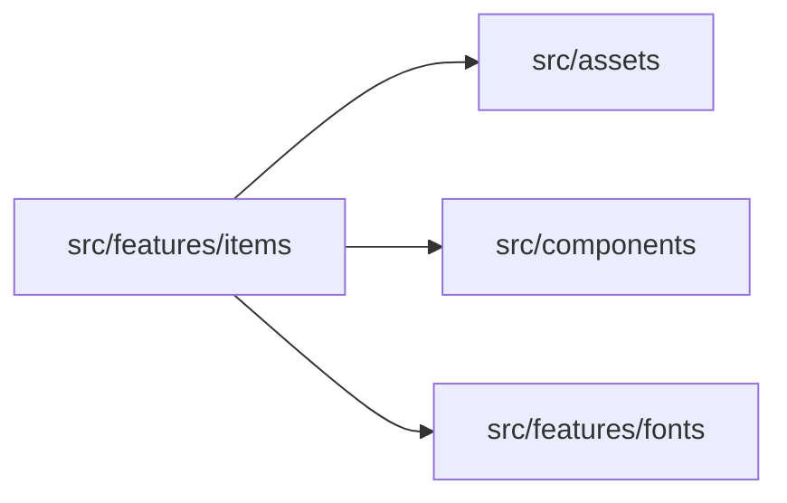
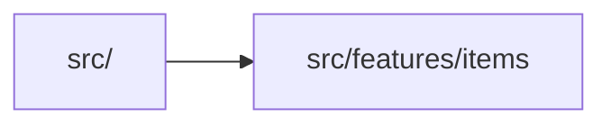

# src/features/items

> Автогенерируемый README модуля.

## 🌟 Кратко

Группа модулей для `features/items`.

## 👥 Подмодули

- 👤 Дочерних подмодулей нет.

## 📄 Файлы

- 📄 [`itemData.ts.md`](itemData.ts.md) - Исходный модуль с 1 внутренней зависимостью. Исходник: [`itemData.ts`](../../../../src/features/items/itemData.ts)
- 📄 [`itemIconsLayer.ts.md`](itemIconsLayer.ts.md) - Исходный модуль с 4 внутренними зависимостями. Исходник: [`itemIconsLayer.ts`](../../../../src/features/items/itemIconsLayer.ts)
- 📄 [`itemInfoPanel.ts.md`](itemInfoPanel.ts.md) - Исходный модуль с 4 внутренними зависимостями. Исходник: [`itemInfoPanel.ts`](../../../../src/features/items/itemInfoPanel.ts)

## 🍎 Зависимости

### 🍎 Зависит от

- `src/assets`
- `src/components`
- `src/features/fonts`

### 🍑 Используется в

- `src/`

