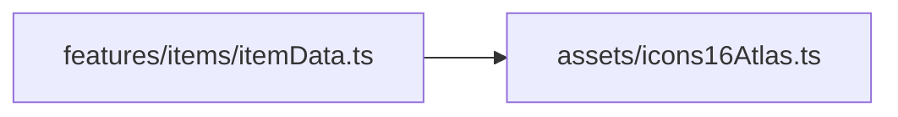
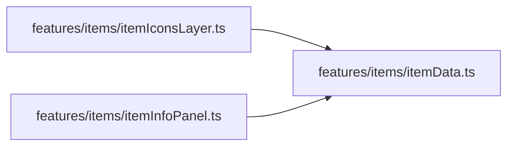

# itemData.ts.md

> Автогенерируемая карточка исходного файла.

## 🌟 Для чего нужен

Нужен как отдельный модуль, который решает свою локальную задачу внутри проекта.

## 🍎 Принцип

Работает как локальный модуль проекта: получает входные данные, подготавливает результат и отдает его другим частям приложения.

## 🧩 Методы

- В этом файле нет явных именованных методов верхнего уровня.

## 👥 Связи

- 👤 Родительский модуль: [`src/features/items`](README.md)
- 📄 Исходный файл: [`itemData.ts`](../../../../src/features/items/itemData.ts)

### 🍎 Зависит от

- 🍎 `assets/icons16Atlas.ts`

### 🍑 Используется в

- 🍑 `features/items/itemIconsLayer.ts`
- 🍑 `features/items/itemInfoPanel.ts`

