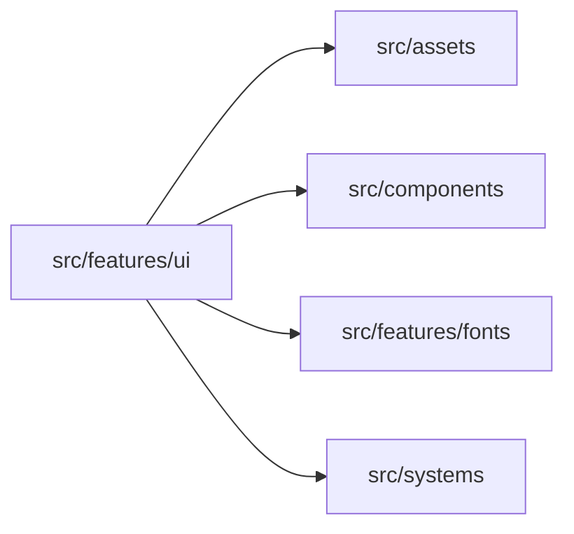
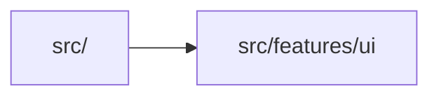

# src/features/ui

> Автогенерируемый README модуля.

## 🌟 Кратко

Группа модулей для `features/ui`.

## 👥 Подмодули

- 👤 Дочерних подмодулей нет.

## 📄 Файлы

- 📄 [`contextMenu.ts.md`](contextMenu.ts.md) - Исходный модуль с 2 внутренними зависимостями. Исходник: [`contextMenu.ts`](../../../../src/features/ui/contextMenu.ts)
- 📄 [`uiDemo.ts.md`](uiDemo.ts.md) - Исходный модуль с 3 внутренними зависимостями. Исходник: [`uiDemo.ts`](../../../../src/features/ui/uiDemo.ts)

## 🍎 Зависимости

### 🍎 Зависит от

- `src/assets`
- `src/components`
- `src/features/fonts`
- `src/systems`

### 🍑 Используется в

- `src/`

