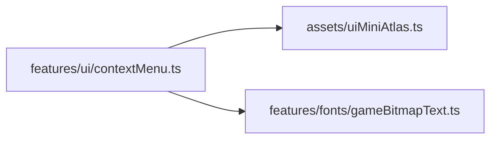
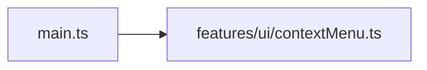

# contextMenu.ts.md

> Автогенерируемая карточка исходного файла.

## 🌟 Для чего нужен

Нужен как отдельный модуль, который решает свою локальную задачу внутри проекта.

## 🍎 Принцип

Работает как локальный модуль проекта: получает входные данные, подготавливает результат и отдает его другим частям приложения.

## 🧩 Методы

- В этом файле нет явных именованных методов верхнего уровня.

## 🔑 Ключевые константы

### `CONTEXT_MENU_BG_X`

- Значение: `0`
- Для чего нужен: Нужна как опорная константа файла: хранит значение, с которым работает остальная логика.

### `CONTEXT_MENU_BG_Y`

- Значение: `80`
- Для чего нужен: Нужна как опорная константа файла: хранит значение, с которым работает остальная логика.

### `CONTEXT_MENU_BG_W`

- Значение: `64`
- Для чего нужен: Нужна как опорная константа файла: хранит значение, с которым работает остальная логика.

### `CONTEXT_MENU_BG_H`

- Значение: `48`
- Для чего нужен: Нужна как опорная константа файла: хранит значение, с которым работает остальная логика.

### `MENU_SCALE`

- Значение: `4`
- Для чего нужен: Нужна как опорная константа файла: хранит значение, с которым работает остальная логика.

### `MENU_Z_INDEX`

- Значение: `30`
- Для чего нужен: Нужна как опорная константа файла: хранит значение, с которым работает остальная логика.

### `MENU_ITEMS`

- Значение: `[ 'Включить отдалку', 'Информация об объекте', 'Удалить объект', ] as const`
- Для чего нужен: Нужна как опорная константа файла: хранит значение, с которым работает остальная логика.

### `DOUBLE_TAP_MAX_DELAY_MS`

- Значение: `350`
- Для чего нужен: Нужна как опорная константа файла: хранит значение, с которым работает остальная логика.

### `DOUBLE_TAP_MAX_DISTANCE`

- Значение: `24`
- Для чего нужен: Нужна как опорная константа файла: хранит значение, с которым работает остальная логика.

## 👥 Связи

- 👤 Родительский модуль: [`src/features/ui`](README.md)
- 📄 Исходный файл: [`contextMenu.ts`](../../../../src/features/ui/contextMenu.ts)

### 🍎 Зависит от

- 🍎 `assets/uiMiniAtlas.ts`
- 🍎 `features/fonts/gameBitmapText.ts`

### 🍑 Используется в

- 🍑 `main.ts`

