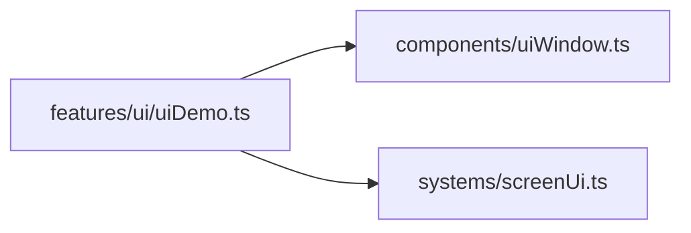
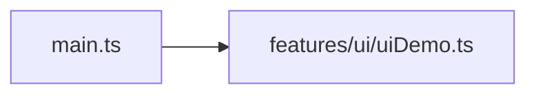

# uiDemo.ts.md

> Автогенерируемая карточка исходного файла.

## 🌟 Для чего нужен

Нужен как отдельный модуль, который решает свою локальную задачу внутри проекта.

## 🍎 Принцип

Работает как локальный модуль проекта: получает входные данные, подготавливает результат и отдает его другим частям приложения.

## 🧩 Методы

- В этом файле нет явных именованных методов верхнего уровня.

## 🔑 Ключевые константы

### `DEMO_CONFIRM_PANEL_WIDTH`

- Значение: `384`
- Для чего нужен: Нужна как опорная константа файла: хранит значение, с которым работает остальная логика.

### `DEMO_CONFIRM_PANEL_HEIGHT`

- Значение: `256`
- Для чего нужен: Нужна как опорная константа файла: хранит значение, с которым работает остальная логика.

### `DEMO_WINDOW_MESSAGE`

- Значение: `[ 'Это screen-space окно не зависит от камеры и не двигается при pan/zoom мира.', 'Врем...`
- Для чего нужен: Нужна как опорная константа файла: хранит значение, с которым работает остальная логика.

### `DEMO_ALERT_MESSAGE`

- Значение: `[ 'Входящее уведомление: мир на паузе не стоит — это краткая сводка поверх игры.', 'Обы...`
- Для чего нужен: Нужна как опорная константа файла: хранит значение, с которым работает остальная логика.

## 👥 Связи

- 👤 Родительский модуль: [`src/features/ui`](README.md)
- 📄 Исходный файл: [`uiDemo.ts`](../../../../src/features/ui/uiDemo.ts)

### 🍎 Зависит от

- 🍎 `components/uiWindow.ts`
- 🍎 `systems/screenUi.ts`

### 🍑 Используется в

- 🍑 `main.ts`

