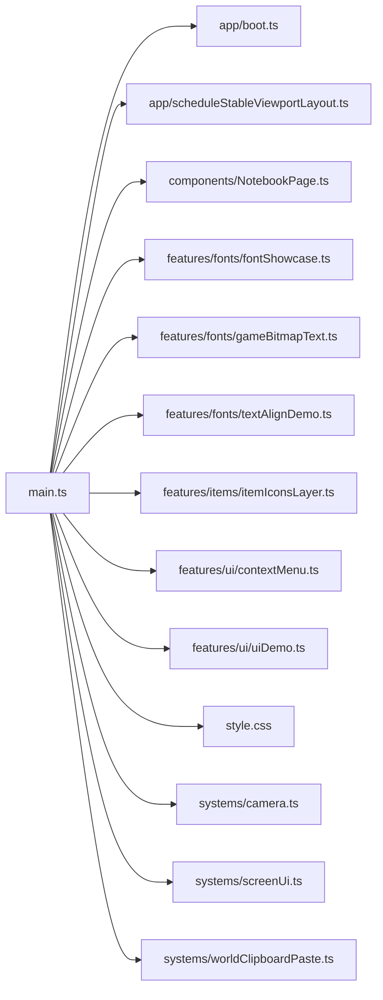

# main.ts.md

> Автогенерируемая карточка исходного файла.

## 🌟 Для чего нужен

Нужен для запуска приложения и сборки стартовой сцены.

## 🍎 Принцип

Собирает точку входа: подключает базовые зависимости, поднимает приложение и добавляет ключевые элементы на сцену.

## 🧩 Методы

- В этом файле нет явных именованных методов верхнего уровня.

## 🔑 Ключевые константы

### `NOTEBOOK_PAGE_UI_SCALE`

- Значение: `4`
- Для чего нужен: Хранит готовый визуальный объект, который потом добавляется на сцену.

### `NOTEBOOK_PAGE_INSET`

- Значение: `12`
- Для чего нужен: Хранит готовый визуальный объект, который потом добавляется на сцену.

### `ORIGINAL_ZOOM`

- Значение: `1`
- Для чего нужен: Нужна как опорная константа файла: хранит значение, с которым работает остальная логика.

### `MIN_ZOOM`

- Значение: `ORIGINAL_ZOOM * 0.25`
- Для чего нужен: Нужна как опорная константа файла: хранит значение, с которым работает остальная логика.

### `MAX_ZOOM`

- Значение: `ORIGINAL_ZOOM * 10`
- Для чего нужен: Нужна как опорная константа файла: хранит значение, с которым работает остальная логика.

### `WHEEL_ZOOM_STEP`

- Значение: `0.0015`
- Для чего нужен: Нужна как опорная константа файла: хранит значение, с которым работает остальная логика.

### `ICON_DISPLAY_SCALE`

- Значение: `4`
- Для чего нужен: Нужна как опорная константа файла: хранит значение, с которым работает остальная логика.

### `ICON_ROW_Y`

- Значение: `480`
- Для чего нужен: Нужна как опорная константа файла: хранит значение, с которым работает остальная логика.

### `ICON_START_X`

- Значение: `72`
- Для чего нужен: Нужна как опорная константа файла: хранит значение, с которым работает остальная логика.

### `ICON_GAP`

- Значение: `56`
- Для чего нужен: Нужна как опорная константа файла: хранит значение, с которым работает остальная логика.

### `FONT_SHOWCASE_X`

- Значение: `560`
- Для чего нужен: Нужна как опорная константа файла: хранит значение, с которым работает остальная логика.

### `FONT_SHOWCASE_Y`

- Значение: `48`
- Для чего нужен: Нужна как опорная константа файла: хранит значение, с которым работает остальная логика.

### `app`

- Значение: `await bootApplication()`
- Для чего нужен: Нужна как опорная константа файла: хранит значение, с которым работает остальная логика.

### `world`

- Значение: `new Container()`
- Для чего нужен: Хранит контейнер сцены, который можно двигать как камеру при панорамировании.

### `uiRoot`

- Значение: `new Container()`
- Для чего нужен: Нужна как опорная константа файла: хранит значение, с которым работает остальная логика.

### `notebookPage`

- Значение: `await createNotebookPage({ x: NOTEBOOK_PAGE_INSET, y: NOTEBOOK_PAGE_INSET, scale: NOTEB...`
- Для чего нужен: Хранит готовый визуальный объект, который потом добавляется на сцену.

### `screenUi`

- Значение: `createScreenUiSystem({ app, root: uiRoot, })`
- Для чего нужен: Нужна как опорная константа файла: хранит значение, с которым работает остальная логика.

### `camera`

- Значение: `createCameraSystem({ app, world, zoomSnapFactor: NOTEBOOK_PAGE_UI_SCALE, originalZoom: ...`
- Для чего нужен: Нужна как опорная константа файла: хранит значение, с которым работает остальная логика.

### `itemLayers`

- Значение: `await createItemIconsLayer({ world, screenToCanvasPoint: camera.screenToCanvasPoint, ge...`
- Для чего нужен: Нужна как опорная константа файла: хранит значение, с которым работает остальная логика.

## 👥 Связи

- 👤 Родительский модуль: [`src/`](README.md)
- 📄 Исходный файл: [`main.ts`](../../src/main.ts)

### 🍎 Зависит от

- 🍎 `app/boot.ts`
- 🍎 `app/scheduleStableViewportLayout.ts`
- 🍎 `components/NotebookPage.ts`
- 🍎 `features/fonts/fontShowcase.ts`
- 🍎 `features/fonts/gameBitmapText.ts`
- 🍎 `features/fonts/textAlignDemo.ts`
- 🍎 `features/items/itemIconsLayer.ts`
- 🍎 `features/ui/contextMenu.ts`
- 🍎 `features/ui/uiDemo.ts`
- 🍎 `style.css`
- 🍎 `systems/camera.ts`
- 🍎 `systems/screenUi.ts`
- 🍎 `systems/worldClipboardPaste.ts`

### 🍑 Используется в

- 🍑 Пока не используется другими файлами из `src/`.
