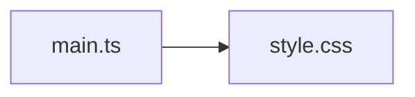

# style.css.md

> Автогенерируемая карточка исходного файла.

## 🌟 Для чего нужен

Нужен для базового внешнего вида страницы и корректного размещения canvas.

## 🍎 Принцип

Задает общие правила отображения страницы, чтобы приложение выглядело и располагалось правильно в браузере.

## 🧩 Методы

- В этом файле нет явных именованных методов верхнего уровня.

## 👥 Связи

- 👤 Родительский модуль: [`src/`](README.md)
- 📄 Исходный файл: [`style.css`](../../src/style.css)

### 🍎 Зависит от

- 🍎 Нет прямых локальных зависимостей.

### 🍑 Используется в

- 🍑 `main.ts`

