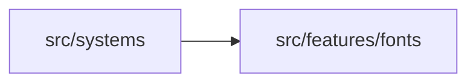
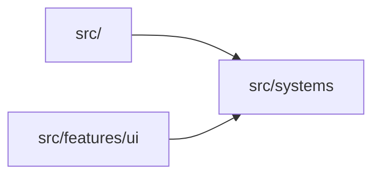

# src/systems

> Автогенерируемый README модуля.

## 🌟 Кратко

Группа модулей для `systems`.

## 👥 Подмодули

- 👤 Дочерних подмодулей нет.

## 📄 Файлы

- 📄 [`camera.ts.md`](camera.ts.md) - Исходный модуль с 0 внутренними зависимостями. Исходник: [`camera.ts`](../../../src/systems/camera.ts)
- 📄 [`screenUi.ts.md`](screenUi.ts.md) - Исходный модуль с 0 внутренними зависимостями. Исходник: [`screenUi.ts`](../../../src/systems/screenUi.ts)
- 📄 [`worldClipboardPaste.ts.md`](worldClipboardPaste.ts.md) - Исходный модуль с 1 внутренней зависимостью. Исходник: [`worldClipboardPaste.ts`](../../../src/systems/worldClipboardPaste.ts)

## 🍎 Зависимости

### 🍎 Зависит от

- `src/features/fonts`

### 🍑 Используется в

- `src/`
- `src/features/ui`

