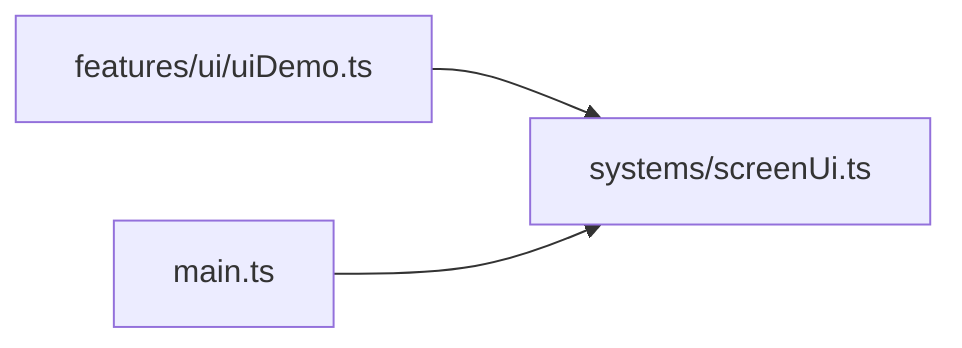

# screenUi.ts.md

> Автогенерируемая карточка исходного файла.

## 🌟 Для чего нужен

Нужен как отдельный модуль, который решает свою локальную задачу внутри проекта.

## 🍎 Принцип

Работает как локальный модуль проекта: получает входные данные, подготавливает результат и отдает его другим частям приложения.

## 🧩 Методы

- В этом файле нет явных именованных методов верхнего уровня.

## 🔑 Ключевые константы

### `DEFAULT_EDGE_INSET_X_FRAC`

- Значение: `24 / 1280`
- Для чего нужен: Нужна как опорная константа файла: хранит значение, с которым работает остальная логика.

### `DEFAULT_EDGE_INSET_Y_FRAC`

- Значение: `24 / 720`
- Для чего нужен: Нужна как опорная константа файла: хранит значение, с которым работает остальная логика.

## 👥 Связи

- 👤 Родительский модуль: [`src/systems`](README.md)
- 📄 Исходный файл: [`screenUi.ts`](../../../src/systems/screenUi.ts)

### 🍎 Зависит от

- 🍎 Нет прямых локальных зависимостей.

### 🍑 Используется в

- 🍑 `features/ui/uiDemo.ts`
- 🍑 `main.ts`

